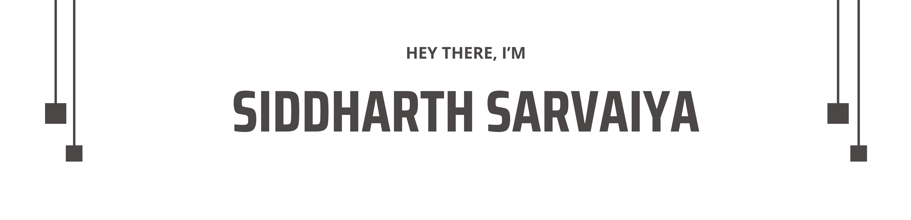

## 👨🏻‍💻 I’m a **Bachelor of Computer Applications Student**.

🔬 I’m currently learning and exploring:
- **MERN Stack Developing**,
- **Data Structures and Algorithms**,
- **Interested in Artificial intelligence, Machine Learning, Deep Learning**,

📫 How to reach me: [Email me](siddharthsarvaiya56@gmail.com)

---

### 💡 Skills

  <kbd style="margin: 10px;padding: 5px 15px;">
    <kbd>Front-end</kbd>
     
     
     
     
    
    
    
    
  </kbd>
  <kbd style="margin: 10px;padding: 5px 15px;">
    <kbd>Back-end</kbd>
     
     
    
    
    
    
  </kbd>
  <kbd style="margin: 10px;padding: 5px 15px;">
    <kbd>Programming Language</kbd>
     
     
    
    
    
    
  </kbd>
  <kbd style="margin: 10px;padding: 5px 15px;">
    <kbd>Database Technology</kbd>
     
     
    
    
    
    
  </kbd>
  <kbd style="margin: 10px;padding: 5px 15px;">
    <kbd>Tools/OS</kbd>
     
     
    
    
    
    
  </kbd>

---

 

---

### Let's Connect :coffee:

	
	
	

---

<b>Visitor's Count</b>

